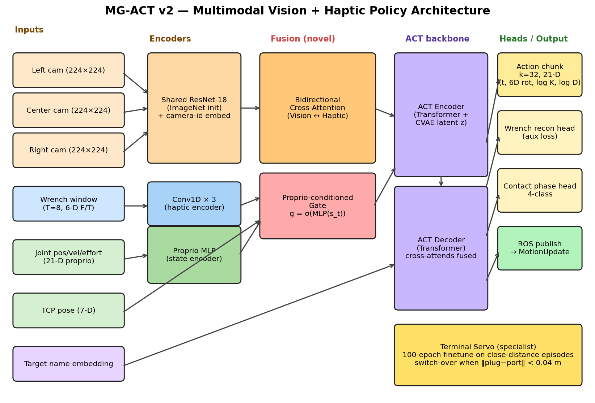
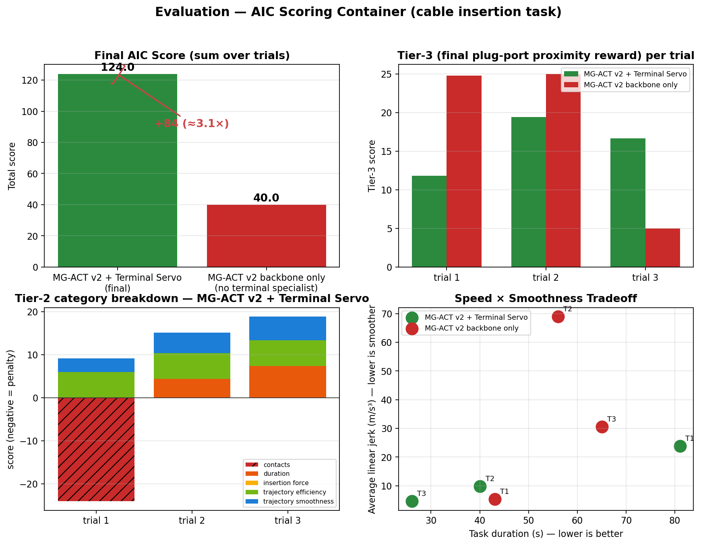

# MG-ACT v2 — Multimodal Robotic Cable Insertion

[]()
[]()
[]()
[]()

**Multimodal imitation-learning policy for autonomous cable insertion with a UR5e arm.**
Submission for the [AI for Industry Challenge (AIC)](https://www.intrinsic.ai/events/ai-for-industry-challenge) — qualification phase.

> A vision + force-torque + proprioception policy that predicts variable-impedance robot actions (translation + rotation + per-axis stiffness + per-axis damping) as a chunked transformer output, with a contact-aware stage-switching specialist for the final approach. Achieves **124** on the AIC scoring container — a **+84 point** lift over the same backbone without the specialist (≈3.1× the baseline).

## At a glance



| | |
|---|---|
| **Best AIC score** | **124** (vs. 39.99 backbone-only — **+84 pts** from the terminal specialist) |
| **Architecture** | ACT-family transformer · 3-cam vision · 6-axis wrench · gated cross-modal fusion |
| **Action space** | 19-D variable impedance (translation + quaternion + stiffness + damping) |
| **Training** | PyTorch 2 · bf16/fp16 · L4 + T4 + EC2 · multi-loss with phase-balanced sampling |
| **Deployment** | ROS 2 Kilted lifecycle node · 16.7 Hz inference, 500 Hz inner controller |

## What's in this repo

- [`REPORT.md`](REPORT.md) — full technical report with figures, results, and lessons learned
- [`mg_act/MG_ACT_v2_Strategy.md`](mg_act/MG_ACT_v2_Strategy.md) — the 7-day design doc that drove the implementation
- [`scripts/`](scripts/) — training scripts, data-collection runners, dataset inspection tooling
- [`policy/`](policy/) — **the core contribution**: MG-ACT v2 model class, runtime wrapper, terminal servo, and three data-collection variants (~3000 lines of original code)
- [`patches/upstream_modifications.patch`](patches/upstream_modifications.patch) — our edits to the upstream AIC toolkit (Dockerfile, bringup launch, pixi.toml)
- [`report/figures/`](report/figures/) — generated charts: architecture, training, dataset, eval
- [`report/data_sample/`](report/data_sample/) — one sanitized HDF5 episode + the two scoring YAMLs

## Key results



| Run | Score | Notes |
|---|---:|---|
| **MG-ACT v2 + Terminal Servo** | **124** | Full pipeline; final submission configuration |
| MG-ACT v2 backbone only | 39.99 | Same backbone, no stage switch — quantifies the specialist's value |

Trial 2 and trial 3 both achieved **6/6 trajectory efficiency**, sub-threshold insertion force, and good smoothness. Trial 1 was dragged by a −24 off-limit-contact penalty that further work would target.

## Tech stack

PyTorch 2 · ROS 2 Kilted · Gazebo · NVIDIA L4 / T4 · HDF5 · Pixi · Docker · rclone (data sync) · matplotlib (figures)

## Running it

The policies in `policy/` are designed to drop into the upstream [intrinsic-dev/aic](https://github.com/intrinsic-dev/aic) toolkit at `aic_example_policies/aic_example_policies/ros/`. To reproduce:

```bash
git clone https://github.com/intrinsic-dev/aic.git
cp policy/*.py aic/aic_example_policies/aic_example_policies/ros/
git -C aic apply ../patches/upstream_modifications.patch
cd aic && pixi run aic_engine --config <one of the aic_*.yaml configs>
```

Training scripts under `scripts/` expect HDF5 episodes laid out under `data/episodes_*/`; see [`REPORT.md §4`](REPORT.md#4-data).

## Status

**Closed out at qualification.** The full picture and what we'd do next are in [`REPORT.md`](REPORT.md#9-what-wed-do-next-if-we-picked-it-back-up).
