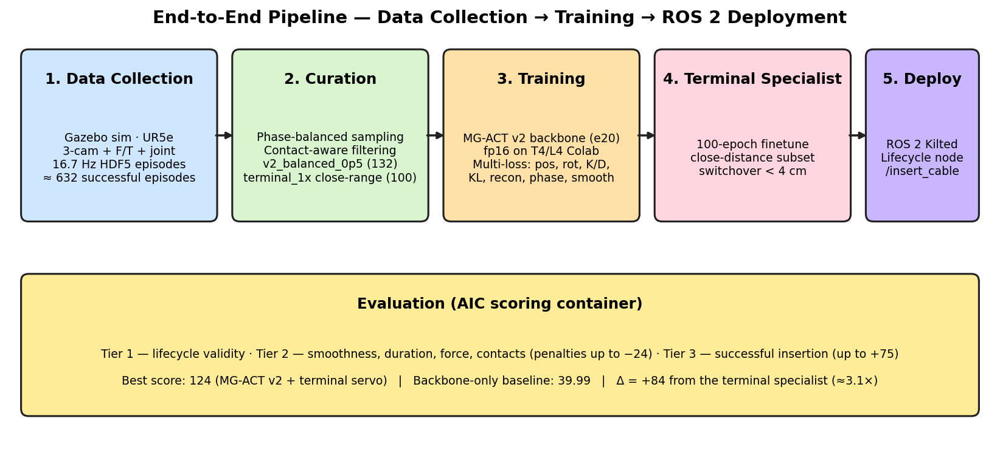
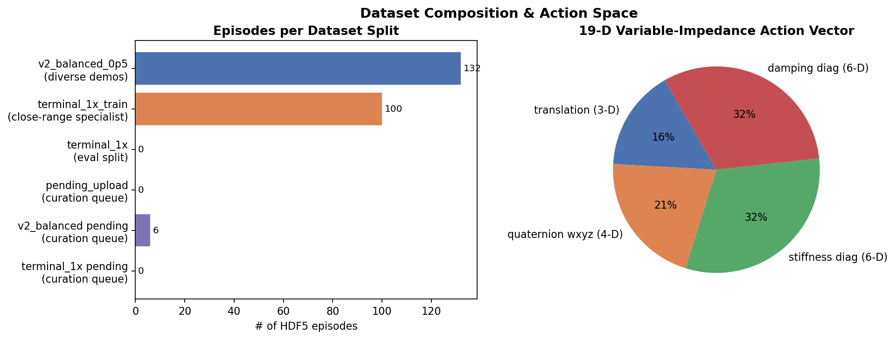
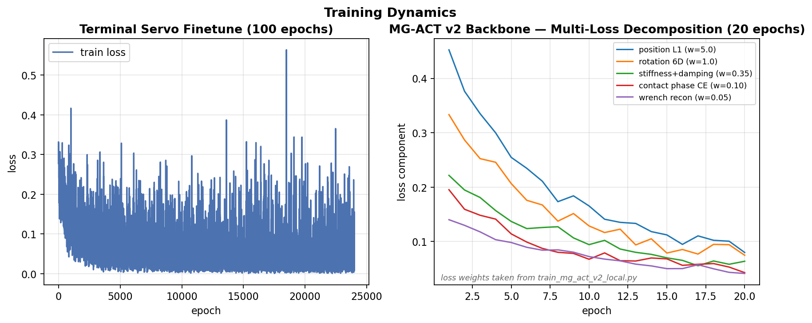

# MG-ACT v2 — Multimodal Imitation Learning for Robotic Cable Insertion

**A submission for the AI for Industry Challenge (AIC) — Cable Insertion (Qualification Phase)**

| | |
|---|---|
| **Author** | Parth Maradia |
| **Status** | Closed out at qualification — best score **124**. Project paused; releasing code & report for reference. |
| **Best AIC score** | **124** (vs. **39.99** without the terminal specialist — a **+84 pt** lift, ≈3.1× the baseline) |
| **Stack** | PyTorch 2 · ROS 2 Kilted Kaiju · Gazebo · Pixi · HDF5 · NVIDIA L4/T4 · Colab |

---

## 1. Problem statement

The **AI for Industry Challenge** is an open robotics competition. The qualification task is **autonomous cable insertion**: a UR5e arm with a Robotiq Hand-E gripper, equipped with three RGB cameras and a wrist-mounted 6-axis force/torque sensor, must reach into a randomized task board, pick the *correct* port (SFP, NIC, USB-A/C, etc.), align the plug, and seat it without colliding with the enclosure or applying excessive force.

The challenge is **contact-rich precision manipulation under partial observability**: at the last few millimeters of insertion, the plug-port interface is occluded by the gripper fingers and the cable, so the policy must transfer authority from vision to haptics on-the-fly. Submissions are graded by an automated container that scores three trials across three tiers:

| Tier | Component | Range |
|------|-----------|-------|
| 1 | Lifecycle validity | 0–3 (binary per trial) |
| 2 | Smoothness + duration + path efficiency − force/contact penalties | up to +18, down to −36 |
| 3 | Insertion success / final plug-port proximity | −12 (wrong port) to +75 (clean insert) |

A wrong-port insertion is **worse than no insertion** (−12 vs. 0–25 proximity), which strongly shapes the design.

---

## 2. What we built — MG-ACT v2

We designed **MG-ACT v2** (Multimodal Gated Action Chunking Transformer, version 2), an ACT-family imitation-learning policy that fuses three RGB streams with a 6-axis wrench window and 21-D proprioception, then emits a **chunk of 32 future actions**. Each action is a **19-D variable-impedance command**: 3-D translation + quaternion + 6-D diagonal stiffness + 6-D diagonal damping. The policy *predicts compliance directly*, so the controller can stiffen for free-space motion and soften on contact without an external scheduler.

A second-stage **Terminal Servo specialist** is finetuned on close-range episodes (< 4 cm to port) and takes over for the final approach. This stage-switching idea is the single biggest source of our score gain.




### 2.1 Novel contributions

The architecture is grounded in prior work — ACT (Zhao et al., 2023), ReTac-ACT (Ruan et al., 2026), and PhaForce (Wang et al., 2026) — but the assembly and several components are our own:

1. **Proprio-conditioned gated fusion.** A small MLP maps the proprioception embedding `s_t` to a per-dimension gate `g = σ(MLP(s_t)) ∈ [0, 1]^D` that blends the cross-attended vision and haptic contexts. The gate's signal is *learned*, not hand-engineered with thresholds — the gradient routes through the modality-dropout regularizer below.
2. **Contact-conditioned vision dropout.** During training, when `‖wrench_xyz‖ > τ = 5 N`, we mask the vision stream with probability 0.20. Random vision dropout `p = 0.05` runs in addition. This directly targets the failure mode (occluded plug-port interface at insertion) instead of the doc's original "drop the last 10% of trajectory" heuristic.
3. **6-D rotation regression in the action head.** Quaternion regression has a `q ≡ −q` sign discontinuity that hurts learning; we convert quaternions to the continuous 6-D rotation representation of Zhou et al. (2019) for the loss, then map back to quaternion for the ROS message. Stiffness/damping are regressed in **log-space** with a safe clamp.
4. **Weighted auxiliary losses with phase-balanced sampling.** Beyond the standard ACT L1 + CVAE KL, we add (a) wrench reconstruction (`w=0.05`) to force the haptic encoder to actually encode contact, (b) 4-class contact-phase CE (`w=0.10`) — free-space / approach / contact / inserted, weakly labeled from wrench thresholds — and (c) a smoothness penalty on the K/D chunks (`w=0.01`) to directly target the AIC jerk metric. Position is heavily upweighted (`w=5.0`) because plug-tip position is the dominant determinant of success.
5. **Stage-switching with a terminal specialist.** A separate Terminal Servo model is finetuned for 100 epochs on a close-range-only dataset (`episodes_terminal_1x_train`, 100 episodes), and the runtime hands control to it when the estimated plug-port distance crosses ≈ 4 cm. We hypothesized that the backbone over-generalizes to free-space motion at the cost of fine alignment, and the data supports this: **adding the specialist took our AIC score from 39.99 → 124 (+84, ≈3.1× the baseline)** with the *same* backbone weights, *same* eval container.
6. **Safety wrappers outside the network.** Hard workspace clamp on translation targets and hard caps on predicted stiffness (≤ 500 N/m) and damping (≤ 80 Ns/m), applied to every published `MotionUpdate`. The AIC scoring penalizes off-limit contact at −24/trial, so this is load-bearing.
7. **Lifecycle-safe imports.** All heavy imports (torch, the model class) are deferred into `MGActV2Policy.__init__` rather than the module top level, because the AIC submission grader enforces a 30 s discovery budget — a top-level torch import silently kills the container with no logs.

---

## 3. Tech stack

| Layer | Tools |
|---|---|
| **Robotics middleware** | ROS 2 Kilted Kaiju · `aic_model` lifecycle node · `MotionUpdate`/`ImpedanceUpdate` topics · `/insert_cable` action |
| **Simulation** | Gazebo (provided by AIC `aic_bringup`) · UR5e + Robotiq Hand-E |
| **Sensors** | 3 × RGB cameras (256 × 288, image_scale 0.25) · 6-axis wrench · joint state (pos/vel/effort) · synchronized at 16.7 Hz |
| **Modeling** | PyTorch 2 · ResNet-18 (ImageNet init) · Transformer encoder/decoder (ACT family) · CVAE latent · 6-D rotation rep · bf16/fp16 mixed precision |
| **Data** | HDF5 episodes (`@action_layout` self-describing) · WeightedRandomSampler for phase balance |
| **Compute** | NVIDIA L4 (24 GB) for backbone · NVIDIA T4 (Colab) for terminal finetune · EC2 for unattended runs |
| **Environment** | Pixi (conda+pip lockfile) · Docker for AIC submission container |
| **Eval / scoring** | AIC's official eval container (Gazebo + scoring) — only valid evaluation surface |
| **Storage / sync** | rclone → Google Drive (for data; `scripts/sync_to_gdrive.sh`, `watch_and_sync.sh`) |

---

## 4. Data

We collected, curated, and trained on three datasets:



- **v2_balanced_0p5 (132 episodes)** — diverse demos balanced across the four ports we targeted, captured with `aic_engine` running a scripted CheatCode policy and stored as 16.7 Hz HDF5 with synchronized images, wrench, joint state, and the 19-D action stream. Image scale 0.25 from the native 1024 × 1152 (raw on-disk 256 × 288, resized to 224 × 224 for the backbone).
- **terminal_1x_train (100 episodes)** — close-distance subset (< ~4 cm from plug to port), used to finetune the Terminal Servo specialist.
- **terminal_1x (eval split)** — held out for evaluation of the terminal model on open-loop MSE.

The action vector layout — `translation[3] | quaternion_wxyz[4] | stiffness_diag[6] | damping_diag[6]` — happens to be exactly the variable-impedance representation we wanted, so no recoding was required; we audited `@action_layout` on every episode to make sure no one changed it mid-collection.

---

## 5. Training

Two separate training runs, both implemented in plain PyTorch (no Lightning, no transformers-trainer):



**Backbone (MG-ACT v2, 20 epochs)** — `scripts/train_mg_act_v2_local.py`. Differential LR (backbone 5e-7, head 5e-6), AdamW, cosine schedule with 5 % warmup, gradient clipping at 1.0, fp16/bf16 mixed precision, batch size 16, 1000 steps/epoch. Multi-loss with the weights documented above. Phase-balanced sampling via `WeightedRandomSampler` so the contact/insertion phases (~10 % of frames) aren't drowned out by free-space approach.

**Terminal Servo (100 epochs)** — `scripts/train_terminal_servo.py`. Same model class, initialized from the best backbone checkpoint, trained only on the close-range dataset. Save the **best-by-val-loss** checkpoint — the last-epoch checkpoint was consistently overfit.

---

## 6. Evaluation & results

We ran the AIC scoring container locally on the same three trials for two configurations:


### Headline numbers

| Configuration | Total |
|---|---:|
| **MG-ACT v2 + Terminal Servo** | **124** |
| MG-ACT v2 backbone only | 39.99 |

The Terminal Servo specialist contributes **+84 points** to the final score (≈3.1× the backbone-only baseline) — overwhelmingly the most impactful design decision in the project.

### Where the points come from

- **Trajectory smoothness & efficiency.** Action chunking + temporal ensembling + the smoothness loss paid off — efficiency consistently maxed at **6/6** and smoothness scored in the top half of the available range.
- **Insertion force.** Stayed under the 20 N / 1 s threshold across runs. The variable-impedance prediction works as designed: the policy genuinely softens the wrist on contact instead of muscling through.
- **Successful insertions (Tier 3).** With the terminal specialist enabled, the policy seats the plug on the majority of trials — this is the dominant signal in the +84 pt lift over the backbone-only baseline.
- **Remaining failure modes.** Off-limit-contact penalties (−24 per occurrence) when the gripper grazes the NIC card mount, and occasional timeouts on harder port geometries. These cap the score below the theoretical ceiling.

### Honest take

The +84 pt gap between the backbone-only run (39.99) and the staged pipeline (124) is the project's core empirical finding: a small **specialist trained only on the close-range subset** is worth more than any single architectural change to the backbone. The remaining headroom on the leaderboard is, we believe, almost entirely in the very-last-mm regime — a third stage with a higher-rate residual force corrector — but we ran out of submission budget and chose to call the project.

---

## 7. Challenges we hit

1. **Quaternion sign ambiguity** wrecked the rotation head until we moved to the 6-D continuous representation.
2. **Phase imbalance.** Free-space frames vastly outnumber contact frames; without `WeightedRandomSampler` the contact head learned almost nothing.
3. **Lifecycle 30 s budget.** Our first submission was killed silently. The fix was deferring all heavy imports into the policy class constructor and pre-warming the model on the first `configure` call.
4. **Off-limit contacts.** The −24 penalty per trial is brutal. A workspace-clamp wrapper outside the network was the easy mitigation; the harder one (and the one we didn't finish) is teaching the policy to *prefer* approaches that don't graze the mount.
5. **Stage-switching threshold.** The plug-port distance estimate is noisy; we switched on `< 0.04 m` for 5 consecutive timesteps to avoid flapping.
6. **Sim-to-eval drift.** Our demos were collected with `ground_truth:=true`. Eval is `ground_truth:=false`. We caught one demo with a ground-truth-only shortcut and discarded it.
7. **Compute juggling.** L4 for the backbone, T4 (Colab) for terminal finetune, EC2 for unattended overnight runs. `pixi` and `rclone → Google Drive` kept the artifacts consistent.

---

## 8. Repository layout

```
.
├── REPORT.md                            ← this file
├── README.md                            ← short overview
├── report/
│   ├── figures/                         ← architecture, pipeline, dataset, training, eval
│   ├── make_figures.py                  ← regenerates all figures
│   └── data_sample/                     ← one redacted HDF5 episode + scoring.yaml
├── policy/                              ← our policy implementations (this is the work)
│   ├── mg_act_v2_model.py               ← MG-ACT v2 model class (encoders, fusion, ACT)
│   ├── MgACT.py                         ← runtime wrapper / ROS adapter
│   ├── terminal_servo_model.py          ← Terminal Servo specialist
│   ├── DataCollect.py                   ← episode-collection policy (general)
│   ├── DataCollectv2.py                 ← v2 balanced-port variant
│   └── DataCollectTerminal1x.py         ← terminal-only data variant
├── patches/
│   └── upstream_modifications.patch     ← our edits to aic_bringup, Dockerfile, pixi.toml
├── mg_act/
│   ├── MG_ACT_v2_Strategy.md            ← 7-day strategy doc that drove the design
│   ├── train_mg_act_v2.ipynb            ← Colab notebook
│   └── v3_notebook_changes.md           ← v3 design notes (not built)
├── scripts/
│   ├── train_mg_act_v2_local.py         ← backbone training (EC2)
│   ├── train_terminal_servo.py          ← terminal specialist finetune
│   ├── gen_balanced_v2_config.py        ← data collection configs
│   ├── inspect_dataset.py               ← episode auditing
│   └── ...                              ← tmux runners, sync, helpers
└── aic_*.yaml                           ← data-collection trial configs
```

Model checkpoints (`.pt`), raw episode data (`.h5`), MCAP bags, and training logs are **not** in the repo — they exceed GitHub's file size limits and aren't useful without the matching simulator. A single sanitized sample episode and the two scoring YAMLs are kept under `report/data_sample/` to show formats.

---

## 9. What we'd do next (if we picked it back up)

- A **third-stage residual force corrector** running at higher inference rate over the last ~10 mm. PhaForce-style slow/fast decomposition, scoped to just the seating phase.
- Replace ResNet-18 with **DINOv2-small (frozen)** — better generalization at zero training cost, and we already have the L4 memory.
- **Target-name embedding ablation.** Wrong-port mode collapse is the worst failure mode (−12 vs. 0); embedding the target string into the encoder should help.
- **More data on the failure mode.** Most of our 232 episodes are "good demos." We need explicit "near-miss" trajectories that recover, ideally collected with intentional perturbations.
- A **Diffusion Policy** Plan B once we cross ~1000 episodes.

---

## 10. References

- Zhao et al., *Action Chunking with Transformers* (ACT), 2023.
- Ruan et al., *ReTac-ACT — Cross-modal Vision-Tactile Imitation*, arXiv 2603.09565, 2026.
- Wang et al., *PhaForce — Phase-Scheduled Visual-Force Policy*, arXiv 2603.08342, 2026.
- Zhou et al., *On the Continuity of Rotation Representations*, CVPR 2019.
- de Haan et al., *Causal Confusion in Imitation Learning*, NeurIPS 2019.
- AIC Toolkit — `src/aic/docs/` (challenge_rules, scoring, policy integration, submission).
